# 👋 Olá, eu sou o Rodrigo ( @rg-hermann )

🚀 DevOps / Cloud / FinOps / Automação | Apaixonado por otimização, confiabilidade e redução de custo inteligente em nuvem.

## 🧑‍💻 Sobre mim
Sou um profissional de **DevOps / Cloud Engineering**. Formado em **Ciência da Computação (SPTech)**, com foco em:
- Infraestrutura como Código (**Terraform**, Bicep)
- Observabilidade (Grafana, Dynatrace, Zabbix)
- **FinOps** & otimização de custo multicloud
- Automação (Pipelines CI/CD, GitHub Actions, Azure DevOps, Ansible)
- Arquitetura resiliente & segurança básica (Segurança de segredos, RBAC, mínimo privilégio)

## 🎯 Objetivos Atuais
- Aprimorar práticas de **FinOps** (OTD, tagging inteligente, chargeback/showback)
- Expandir IaC multi-provedor (Azure / AWS)
- Escalar automações usando módulos e reuso padronizado

## �️ Tecnologias & Ferramentas
| Cloud | IaC | DevOps / CI | Observabilidade | Linguagens | Outras |
|-------|-----|-------------|-----------------|------------|--------|
| Azure, AWS | Terraform, Bicep | GitHub Actions, Azure Pipelines | Grafana, Dynatrace, Zabbix | Python, Bash, PowerShell | Docker, Helm, K8s, Key Vault |

## 📈 Métricas Dinâmicas
As imagens abaixo são geradas automaticamente via GitHub Actions (ver workflows em `.github/workflows`).

### Visão Geral

<!-- Métricas consolidadas (gerada por lowlighter/metrics) -->

### Stats Complementares

<!-- GitHub Readme Stats (serviço público - pode falhar em horários de pico) -->

<!-- Streak -->

<!-- Trophies -->

### Snake (Contribuições)
<picture>
    <source media="(prefers-color-scheme: dark)" srcset="dist/github-snake-dark.svg?palette=github-dark" />
    <source media="(prefers-color-scheme: light)" srcset="dist/github-snake.svg" />
    
</picture>

    

## 🚀 Projetos Destaque
| Projeto | Descrição | Stack |
|---------|-----------|-------|
| `modules_terraform` | Módulos reutilizáveis Terraform (AKS, ACR, Function, KV etc.) | Terraform, Azure |
| `azure_func_python` | Exemplo de Azure Function em Python com HttpTrigger | Python, Azure Functions |
| `app-python` | App container + Helm Chart para deploy em K8s | Python, Docker, Helm |

> Veja mais em [Repositórios](https://github.com/rg-hermann?tab=repositories).

## 🤝 Colaboração & Interesses
- Projetos de **Infraestrutura como Código** (módulos, padrões, governança)
- Pipelines e **Automação** de provisionamento / entrega
- Observabilidade & Dados de Uso para FinOps
- Qualidade / Segurança (linting, políticas, compliance leve)

## 📚 Roadmap de Aprendizado
- Aprofundar: Custos avançados (rightsizing dinâmico, políticas automáticas)
- Estudar: AWS Landing Zones / Control Tower
- Explorar: OpenTelemetry + Distribuição de traces

## 📫 Contato
| Canal | Link |
|-------|------|
| LinkedIn | [linkedin.com/in/rodrigo-garcez-hermann](https://www.linkedin.com/in/rodrigo-garcez-hermann/) |
| E-mail | rodrigohermann18@outlook.com |

## ⚡ Curiosidades
- Entusiasta de **metodologias ágeis** e melhoria contínua
- Gosto de experimentar otimizações de custo em lab pessoal
- Participo de hackathons e mantenho pequenos scripts de automação

---
---

<i>Se esse perfil te ajudou, considere deixar uma ⭐ em algum repositório!</i>

